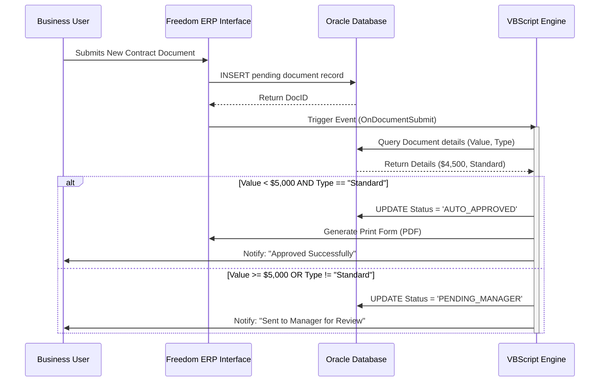

# Workflow Architecture

The following diagram illustrates the automated document approval workflow implemented within the Freedom ERP system.

```mermaid
sequenceDiagram
    participant User as Business User
    participant ERP as Freedom ERP Interface
    participant DB as Oracle Database
    participant Macro as VBScript Engine

    User->>ERP: Submits New Contract Document
    ERP->>DB: INSERT pending document record
    DB-->>ERP: Return DocID
    ERP->>Macro: Trigger Event (OnDocumentSubmit)
    
    activate Macro
    Macro->>DB: Query Document details (Value, Type)
    DB-->>Macro: Return Details ($4,500, Standard)
    
    alt Value < $5,000 AND Type == "Standard"
        Macro->>DB: UPDATE Status = 'AUTO_APPROVED'
        Macro->>ERP: Generate Print Form (PDF)
        Macro->>User: Notify: "Approved Successfully"
    else Value >= $5,000 OR Type != "Standard"
        Macro->>DB: UPDATE Status = 'PENDING_MANAGER'
        Macro->>User: Notify: "Sent to Manager for Review"
    end
    deactivate Macro
```
